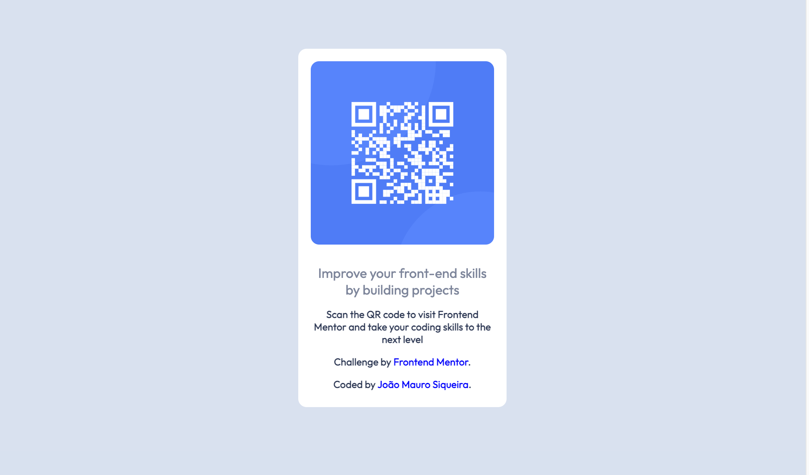

# Frontend Mentor - QR code component solution

This is a solution to the [QR code component challenge on Frontend Mentor](https://www.frontendmentor.io/challenges/qr-code-component-iux_sIO_H). Frontend Mentor challenges help you improve your coding skills by building realistic projects. 

### Screenshot

### Links

- Solution URL: [Add solution URL here](https://your-solution-url.com)
- Live Site URL: [Add live site URL here](https://riuoki.github.io/qrcode-main/)

### Built with

- HTML5
- CSS custom properties

### What I learned

"It was a good exercise to review the principles of HTML and CSS, especially for me as a beginner in the field."

## Author

- Website - [João Mauro Siqueira](https://github.com/Riuoki)
- Frontend Mentor - [@Riuoki](https://www.frontendmentor.io/profile/Riuoki)

## Acknowledgments

"I would like to express my immense gratitude to my friend Alef, without whom my journey into programming would not have been possible. I am forever grateful for their persistence in believing in me."
